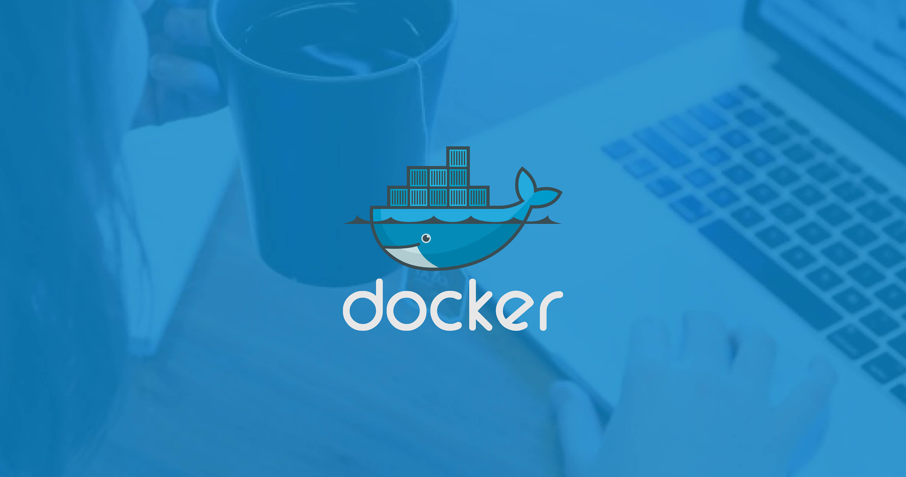
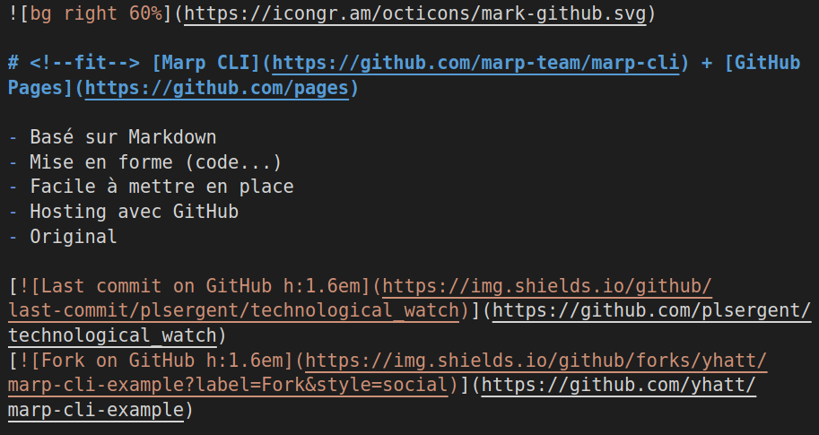
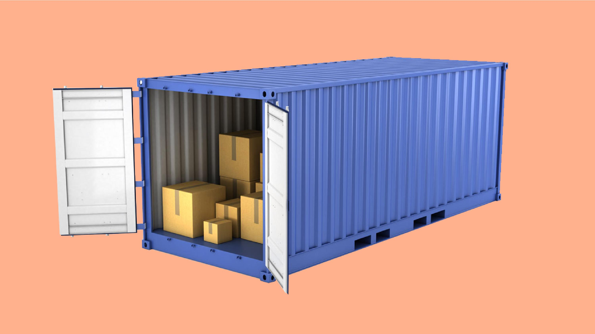
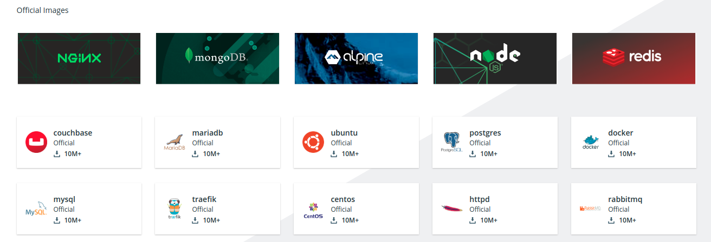
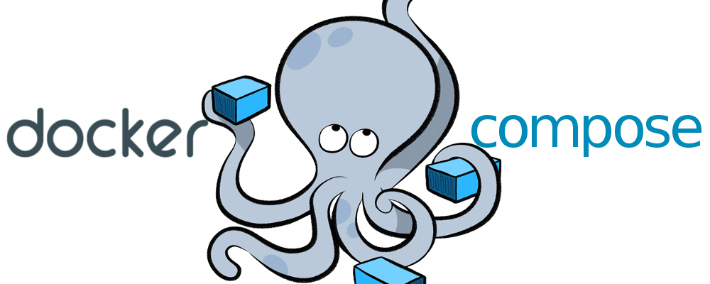

---


### Made with love using (quick intro)

---


# <!--fit--> [Marp CLI](https://github.com/marp-team/marp-cli) + [GitHub Pages](https://github.com/pages)

- Basé sur Markdown
- Mise en forme (code...)
- Facile à mettre en place
- Hosting avec GitHub
- Original

[](https://github.com/plsergent/technological_watch)
[](https://github.com/yhatt/marp-cli-example)

---



---

# Bref

## Revenons à notre baleine

<style scoped>h2 { color: #499FEE; }</style>

---

# Docker définition

- ***PaaS*** : plateform as a service
- qui délivre entre autre un logiciel ...
- permettant de lancer des applications dans des **conteneurs** ...
- ... en s'appuyant sur le *Docker Engine*

#### C'est quoi un conteneur (container in anglich)?

<style scoped>h4 { color: #499FEE; }</style>

---



---


---

# <!--fit--> Ça sert à quoi tout ça ?
## 🤔

<style scoped>h2 { font-size: 200px; }</style>

---

# Debug your app, not your environment
### Securely build, share and run any application, anywhere

- Déploiement
- Environnement transportable, unique
- Architecture en microservices
- Environnement développement

<style scoped>
    h1 { color: #499FEE; }
    h3 { color: black; }
</style>

---

# Getting started
- Installer **docker** et **docker-compose** (on verra ça plus tard)
- Deux commandes à connaître :
    - ```docker build```
    - ```docker run```

---

## Dockerfile

```
FROM ubuntu:16.04
RUN apt-get update -y && \
    apt-get install -y python-pip python-dev

COPY ./requirements.txt /app/requirements.txt

WORKDIR /app

RUN pip install -r requirements.txt

COPY . /app

ENTRYPOINT [ "python" ]
CMD [ "app.py" ]
```

---

### Ensuite :

```docker build -t flask-tutorial:latest .```
```docker run -d -p 5000:5000 flask-tutorial```

## Et bim ça tourne sur le port 5000

# :ok_hand:

<style scoped>
h2 { color: #499FEE; }
h1 {font-size: 140px}
</style>

---

# Docker Hub



---



---

```yaml
version: '3'
services:
  web:
    build: .
    ports:
      - "8000:80"
    volumes:
      - ./src/:/app
    links:
      - mongodb
  
  mongodb: 
    image: mongo:latest
    container_name: "mongodb_blog"
    environment:
      - MONGO_DATA_DIR=/data/db
      - MONGO_LOG_DIR=/dev/null
    volumes:
      - ./data/db:/data/db
    ports:
      - 27017:27017
```

---

```docker compose up```
--

- Lance les conteneurs du fichier
- Établis les liens indiqués entre les conteneurs
- Application qui tourne sur le port 8000

---

# Aller plus loin
- Ansible
- Chef
- Vagrant
- Jenkins
- Kubernetes
- ...


---

### Created by Pierre-Louis Sergent ([@plsergent](https://github.com/plsergent))

- https://www.docker.com/
- https://www.wikiwand.com/en/Docker_(software)
- https://blog.netapp.com/blogs/containers-vs-vms/
- https://techcrunch.com/2019/04/30/docker-updates-focus-on-simplifying-life-for-developers/